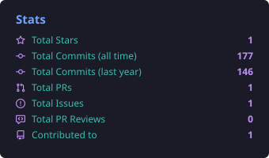
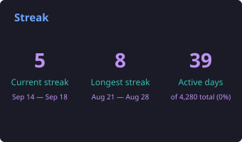
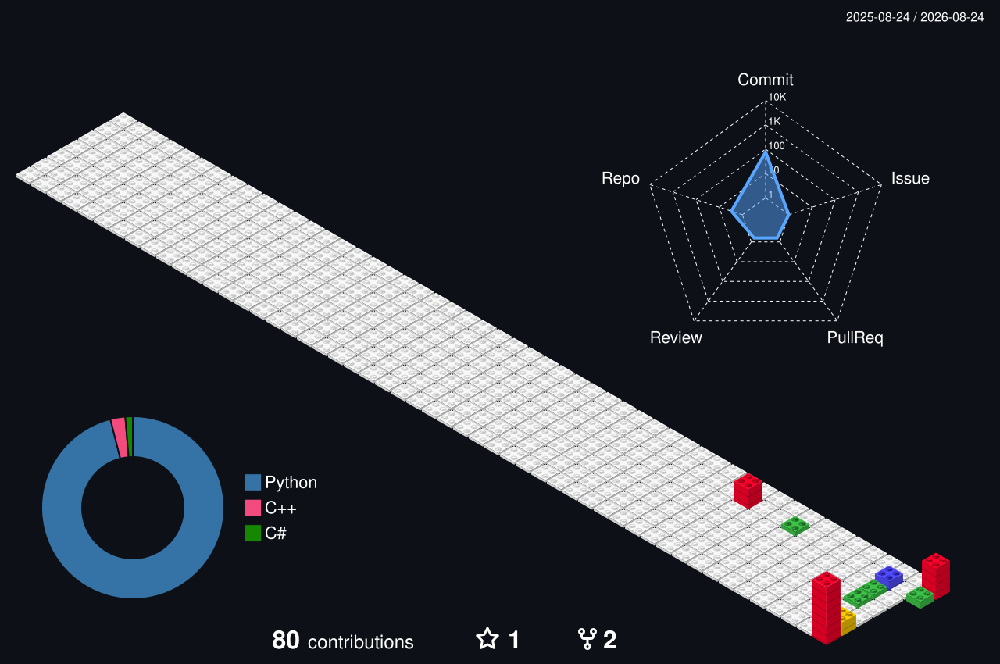

# ¡Hola! Soy Ismael 👋 

### Analista Programador .NET | Data Scientist | IoT & Embedded Systems Specialist

Me considero un desarrollador polivalente con un perfil híbrido. Combino años de experiencia en el desarrollo de software empresarial e infraestructuras críticas con una especialización activa en Ciencia de Datos, Inteligencia Artificial y arquitecturas de hardware (Sistemas Embebidos, IoT, GIS y tecnologías aeroespaciales).

## 🛠️ Tecnologías y Herramientas

  <!-- COLUMNA IZQUIERDA: GIF -->
  

    
  

  <!-- COLUMNA DERECHA: TEXTO -->
  

    <h3>💻 Desarrollo de Software & Backend</h3>
    <ul>
      <li><b>Lenguajes:</b> C#, Java, PHP, JavaScript, SQL, HTML5, CSS3</li>
      <li><b>Frameworks & Librerías:</b> .NET Core, .NET Framework 4.8, Spring Boot, ReactJS, jQuery, Bootstrap 4</li>
      <li><b>Bases de Datos:</b> SQL Server, Oracle PL/SQL</li>
      <li><b>Control de Versiones & Gestión:</b> Git, TFS, Subversion, Jira</li>
    </ul>
    <h3>📊 Data Science & Inteligencia Artificial</h3>
    <ul>
      <li><b>Análisis de Datos:</b> Python (Pandas, NumPy), JSON</li>
      <li><b>BI & ETL:</b> Power BI, Pentaho, Crystal Reports, RDLC</li>
    </ul>
    <h3>🔌 Hardware, IoT & Sistemas GIS</h3>
    <ul>
      <li><b>Electrónica & Control:</b> Microcontroladores (MSP430, Arduino, Raspberry Pi), MATLAB (Simulink), PSpice, Eagle</li>
      <li><b>Entornos 3D & GIS:</b> QGIS (Datos satelitales y drones), Unity, Blender, Impresión 3D</li>
      <li><b>Sistemas & Protocolos:</b> Mensajería HL7, Mirth Connect, Redes Cisco</li>
    </ul>
    <h3>🚀 Formación Destacada (Especializaciones SEPE)</h3>
    
Actualmente me encuentro ampliando y certificando mis conocimientos técnicos mediante itinerarios oficiales del SEPE/Ministerio de Trabajo:

    <ul>
      <li>🛰️ <b>Satélites y Drones:</b> Desarrollo de Aplicaciones (IFCD0089)</li>
      <li>🤖 <b>Inteligencia Artificial y Big Data</b> aplicables en entornos 5G (IFCD99)</li>
      <li>🌐 <b>Soluciones de IoT y Smart City</b> aplicables a entornos 5G (IFCD97)</li>
      <li>🕶️ <b>Realidad Virtual y Realidad Aumentada</b> en entornos 5G (IFCD102)</li>
      <li>📈 <b>Data Science</b> (IFCT156PO) — <i>Especialización intensiva de 600 horas</i></li>
    </ul>
  

 

## 📊 GitHub Stats

  
  

## 💻 Most Used Languages

  

## 📅 Contributions

  

## 📬 Conecta conmigo
* 💼 [Mi Perfil de LinkedIn](https://linkedin.com/ispiga)
* 📧 [ipinzon.quiroga@gmail.com](mailto:ipinzon.quiroga@gmail.com)

