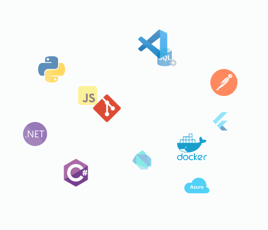

# ¡Hola! Soy Ismael 👋

### Full Stack Developer | Software Analyst

Me considero un desarrollador polivalente con un perfil híbrido. Combino años de experiencia en el desarrollo de software empresarial e infraestructuras críticas con una especialización activa en Ciencia de Datos, Inteligencia Artificial, arquitecturas de hardware (Sistemas Embebidos, IoT) y tecnologías Satelitales (GIS).

---

 

## 🛠️ Tecnologías y Herramientas

<h3>💻 Desarrollo de Software & Backend</h3>

<ul>
  <li><b>Lenguajes Programación:</b> C#, Python, Dart, JavaScript, Java, PHP</li>
  <li><b>Backend:</b> .NET 10, .NET Framework 4.8, Entity Framework, ADO.NET, Web Services, API REST, Postman, Swagger, mensajería HL7, Mirth Connect</li>
  <li><b>Backend:</b> jQuery, ReactJS, HTML5, CSS3, Bootstrap, Flutter</li>
  <li><b>Bases de Datos:</b> SQL Server, Redis, Cassandra</li>
  <li><b>Cloud, DevOps & Control de Versiones:</b> Azure, IIS, Docker, Git, GitHub, TFS, Subversion</li>
  <li><b>Authentication & Security:</b> OAuth, SAML, Cl@ve, Certificados digitales</li>
</ul>

<h3>🧠 Metodologías Ágiles & IA</h3>

<ul>
  <li>Scrum, Kanban, Notion, Jira, Prompt Engineering, AI Coding Assistants</li>
</ul>

<h3>📊 Data Science & Bussiness Intelligence</h3>

<ul>
  <li>Pandas, NumPy, ETL, Pentaho, Power BI</li>
</ul>

<h3>📄 Reports</h3>

<ul>
  <li>Crystal Reports, RDLC</li>
</ul>

  <picture>
    <source
      media="(prefers-color-scheme: dark)"
      srcset="./assets/technologies-dark.gif"
    />
    <source
      media="(prefers-color-scheme: light)"
      srcset="./assets/technologies-light.gif"
    />
    
  </picture>

<h3>🔌 IoT, Hardware & Sistemas GIS</h3>

<ul>
  <li><b>Electrónica & Control:</b> Microcontroladores (ESP32, MSP430, Arduino, Raspberry Pi), MATLAB (Simulink), PSpice, Eagle, Osciloscopio, Generador funciones</li>
  <li><b>Entornos 3D:</b> Unity, Blender, Impresión 3D</li>
  <li><b>GIS:</b> QGIS, Datos satelitales y drones</li>
</ul>

<h3>🚀 Formación Destacada (Especializaciones)</h3>

Actualmente me encuentro ampliando y certificando mis conocimientos técnicos mediante itinerarios oficiales del SEPE/Ministerio de Trabajo:

<ul>
  <li>📲 <b>Desarrollo de aplicaciones móviles para IOS y Android con Flutter</b> (IFCD0002) - 240 horas</li>
  <li>🌐 <b>Programación Soluciones de IoT y Smart City aplicables a entornos 5G</b> (IFCD97) - 150 horas</li>
  <li>🕶️ <b>Programación Realidad Virtual y Realidad Aumentada aplicables a entornos 5G</b> (IFCD102) - 150 horas</li>
  <li>🛰️ <b>Satélites y Drones - Desarrollo de Aplicaciones</b> (IFCD0089) - 160 horas</li>
  <li>🤖 <b>Programación Inteligencia Artificial y Big Data aplicables a entornos 5G</b> (IFCD99) - 150 horas</li>
  <li>📈 <b>Data Science</b> (IFCT156PO) - 600 horas</li>
</ul>

---

 

## 📊 GitHub Stats

  <picture>
    <source
      media="(prefers-color-scheme: dark)"
      srcset="./output/tokyonight/stats.svg"
    />
    <source
      media="(prefers-color-scheme: light)"
      srcset="./output/github/stats.svg"
    />
    
  </picture>

  <picture>
    <source
      media="(prefers-color-scheme: dark)"
      srcset="./output/tokyonight/streak.svg"
    />
    <source
      media="(prefers-color-scheme: light)"
      srcset="./output/github/streak.svg"
    />
    
  </picture>

---

 

## 💻 Most Used Languages

  

---

 

## 📅 Contributions

  <picture>
    <source
      media="(prefers-color-scheme: dark)"
      srcset="./profile-3d-contrib/profile-custom-gitblock-dark.svg"
    />
    <source
      media="(prefers-color-scheme: light)"
      srcset="./profile-3d-contrib/profile-custom-gitblock-light.svg"
    />
    

  </picture>

---

 

## 📬 Conecta conmigo

- 🌐 [Web](https://ispiga.neocities.org)
- 💼 [Mi Perfil de LinkedIn](https://linkedin.com/ispiga)
- 📧 [ipinzon.quiroga@gmail.com](mailto:ipinzon.quiroga@gmail.com)
