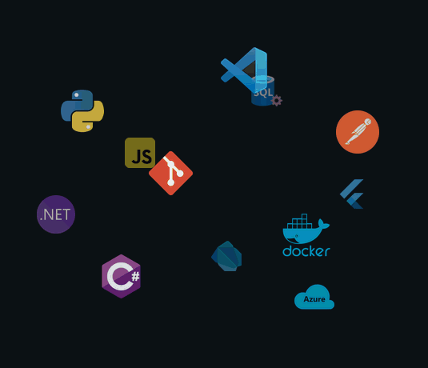

# ¡Hola! Soy Ismael 👋

### Analista Programador .NET | Data Scientist | IoT & Embedded Systems Specialist

Me considero un desarrollador polivalente con un perfil híbrido. Combino años de experiencia en el desarrollo de software empresarial e infraestructuras críticas con una especialización activa en Ciencia de Datos, Inteligencia Artificial y arquitecturas de hardware (Sistemas Embebidos, IoT, GIS y tecnologías aeroespaciales).

## 🛠️ Tecnologías y Herramientas

<table width="100%">
  <tr>

  <td width="40%" align="center" valign="top">

  <picture>
  <source
    media="(prefers-color-scheme: dark)"
    srcset="./assets/technologies-dark.gif"
  />

  <source
    media="(prefers-color-scheme: light)"
    srcset="./assets/technologies-light.gif"
  />

  
</picture>

  </td>

  <td width="60%" valign="top">

  <h3>💻 Desarrollo de Software & Backend</h3>

  <ul>
  <li><b>Lenguajes:</b> C#, Java, PHP, JavaScript, SQL, HTML5, CSS3</li>

  <li><b>Frameworks & Librerías:</b> .NET Core, .NET Framework 4.8, Spring Boot, ReactJS, jQuery, Bootstrap 4</li>

  <li><b>Bases de Datos:</b> SQL Server, Oracle PL/SQL</li>

  <li><b>Control de Versiones & Gestión:</b> Git, TFS, Subversion, Jira</li>
  </ul>

  <h3>📊 Data Science & Inteligencia Artificial</h3>

  <ul>
  <li><b>Análisis de Datos:</b> Python (Pandas, NumPy), JSON</li>

  <li><b>BI & ETL:</b> Power BI, Pentaho, Crystal Reports, RDLC</li>
  </ul>

  <h3>🔌 Hardware, IoT & Sistemas GIS</h3>

  <ul>
  <li><b>Electrónica & Control:</b> Microcontroladores (MSP430, Arduino, Raspberry Pi), MATLAB (Simulink), PSpice, Eagle</li>

  <li><b>Entornos 3D & GIS:</b> QGIS (Datos satelitales y drones), Unity, Blender, Impresión 3D</li>

  <li><b>Sistemas & Protocolos:</b> Mensajería HL7, Mirth Connect, Redes Cisco</li>
  </ul>

  <h3>🚀 Formación Destacada (Especializaciones SEPE)</h3>

  

        Actualmente me encuentro ampliando y certificando mis conocimientos
        técnicos mediante itinerarios oficiales del SEPE/Ministerio de Trabajo:
      

  <ul>
  <li>🛰️ <b>Satélites y Drones:</b> Desarrollo de Aplicaciones (IFCD0089)</li>

  <li>🤖 <b>Inteligencia Artificial y Big Data</b> aplicables en entornos 5G (IFCD99)</li>

  <li>🌐 <b>Soluciones de IoT y Smart City</b> aplicables a entornos 5G (IFCD97)</li>

  <li>🕶️ <b>Realidad Virtual y Realidad Aumentada</b> en entornos 5G (IFCD102)</li>

  <li>📈 <b>Data Science</b> (IFCT156PO) — <i>Especialización intensiva de 600 horas</i></li>
      </ul>

  </td>

  </tr>
</table>

## 📊 GitHub Stats

<table width="100%">
  <tr>

  <td width="50%" align="center">

  <h3>GitHub Stats</h3>

  <picture>
        <source
          media="(prefers-color-scheme: dark)"
          srcset="./output/tokyonight/stats.svg"
        />

  <source
          media="(prefers-color-scheme: light)"
          srcset="./output/github/stats.svg"
        />

  
      </picture>

  </td>

  <td width="50%" align="center">

  <h3>GitHub Streak</h3>

  <picture>
        <source
          media="(prefers-color-scheme: dark)"
          srcset="./output/tokyonight/streak.svg"
        />

  <source
          media="(prefers-color-scheme: light)"
          srcset="./output/github/streak.svg"
        />

  
      </picture>

    </td>

  </tr>
</table>

## 💻 Most Used Languages

  

## 📅 Contributions

  

## 📬 Conecta conmigo

* 💼 [Mi Perfil de LinkedIn](https://linkedin.com/ispiga)

* 📧 [ipinzon.quiroga@gmail.com](mailto:ipinzon.quiroga@gmail.com)

