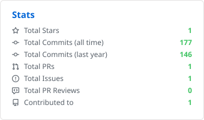
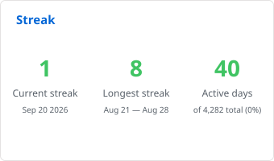
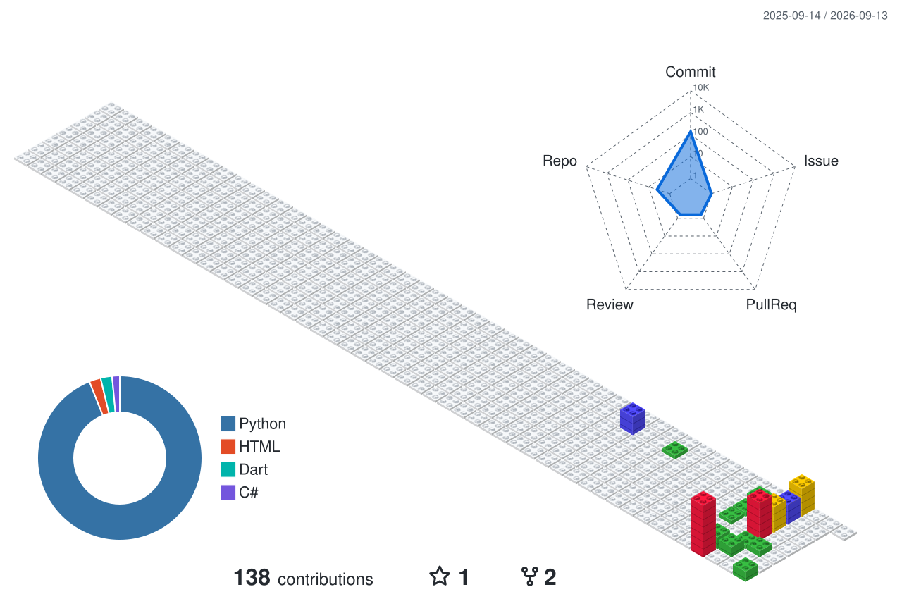

# ¡Hola! Soy Ismael 👋

### Analista Programador .NET | Data Scientist | IoT & Embedded Systems Specialist

Me considero un desarrollador polivalente con un perfil híbrido. Combino años de experiencia en el desarrollo de software empresarial e infraestructuras críticas con una especialización activa en Ciencia de Datos, Inteligencia Artificial y arquitecturas de hardware (Sistemas Embebidos, IoT, GIS y tecnologías aeroespaciales).

---

## 🛠️ Tecnologías y Herramientas

  

### 💻 Desarrollo de Software & Backend

- **Lenguajes:** C#, Java, PHP, JavaScript, SQL, HTML5, CSS3
- **Frameworks & Librerías:** .NET Core, .NET Framework 4.8, Spring Boot, ReactJS, jQuery, Bootstrap 4
- **Bases de Datos:** SQL Server, Oracle PL/SQL
- **Control de Versiones & Gestión:** Git, TFS, Subversion, Jira

### 📊 Data Science & Inteligencia Artificial

- **Análisis de Datos:** Python (Pandas, NumPy), JSON
- **BI & ETL:** Power BI, Pentaho, Crystal Reports, RDLC

### 🔌 Hardware, IoT & Sistemas GIS

- **Electrónica & Control:** Microcontroladores (MSP430, Arduino, Raspberry Pi), MATLAB (Simulink), PSpice, Eagle
- **Entornos 3D & GIS:** QGIS (Datos satelitales y drones), Unity, Blender, Impresión 3D
- **Sistemas & Protocolos:** Mensajería HL7, Mirth Connect, Redes Cisco

### 🚀 Formación Destacada (Especializaciones SEPE)

Actualmente me encuentro ampliando y certificando mis conocimientos técnicos mediante itinerarios oficiales del SEPE/Ministerio de Trabajo:

- 🛰️ **Satélites y Drones:** Desarrollo de Aplicaciones (IFCD0089)
- 🤖 **Inteligencia Artificial y Big Data** aplicables a entornos 5G (IFCD99)
- 🌐 **Soluciones de IoT y Smart City** aplicables a entornos 5G (IFCD97)
- 🕶️ **Realidad Virtual y Realidad Aumentada** en entornos 5G (IFCD102)
- 📈 **Data Science** (IFCT156PO) — *Especialización intensiva de 600 horas*

---

## 📊 GitHub Stats

  <picture>
    <source
      media="(prefers-color-scheme: dark)"
      srcset="./output/github_dark/stats.svg"
    />
    <source
      media="(prefers-color-scheme: light)"
      srcset="./output/github/stats.svg"
    />
    
  </picture>

  <picture>
    <source
      media="(prefers-color-scheme: dark)"
      srcset="./output/github_dark/streak.svg"
    />
    <source
      media="(prefers-color-scheme: light)"
      srcset="./output/github/streak.svg"
    />
    
  </picture>

---

## 💻 Most Used Languages

  

---

## 📅 Contributions

  <picture>
    <source
      media="(prefers-color-scheme: dark)"
      srcset="./profile-3d-contrib/profile-custom-gitblock-dark.svg"
    />
    <source
      media="(prefers-color-scheme: light)"
      srcset="./profile-3d-contrib/profile-custom-gitblock-light.svg"
    />
    

  </picture>

---

## 📬 Conecta conmigo

- 💼 [Mi Perfil de LinkedIn](https://linkedin.com/ispiga)
- 📧 [ipinzon.quiroga@gmail.com](mailto:ipinzon.quiroga@gmail.com)
